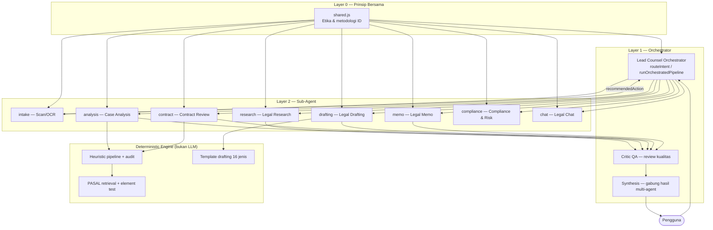

# KNSL Agent Flow — Firma Hukum Virtual (Layer 0 → Orchestrator → Sub-Agent)

Panduan arsitektur multi-agent KNSL Legal Intelligence agar berperilaku seperti **lawyer papan atas**: analisa perkara, riset hukum, tinjauan kontrak, legal drafting, memo, kepatuhan, dan QA.

---

## 1. Diagram alur



---

## 2. Hierarki prompt (dari atas ke bawah)

| Layer | File | Peran |
|-------|------|-------|
| **0** | `src/agents/prompts/shared.js` | Prinsip hukum bersama semua agent |
| **1** | `src/agents/prompts/master.js` | Orchestrator routing + synthesis |
| **2a** | `caseAnalysis.js` | Fakta atomik, isu, rerank pasal |
| **2b** | `contractReview.js` | Tinjau klausul, redraft |
| **2c** | `legalResearch.js` | Riset pasal & prosedur |
| **2d** | `legalDrafting.js` | Draft surat/kontrak/gugatan |
| **2e** | `legalMemo.js` | Memo IRAC / firma style |
| **2f** | `compliance.js` | Gap analysis & checklist |
| **2g** | `legalChat.js` | Q&A riset umum |
| **2h** | `scanIntel.js` | Klasifikasi dokumen OCR |
| **2i** | `critic.js` | QA partner review |

---

## 3. Layer 0 — Prinsip bersama (ringkasan)

Semua sub-agent mewarisi `SHARED_LEGAL_PRINCIPLES`:

1. Yurisdiksi Indonesia (UUD, KUHP/KUHAP, KUHPerdata, UU sektoral).
2. Transisi KUHP lama → UU 1/2023 bila relevan.
3. Pisahkan fakta / analisa / opini / rekomendasi.
4. **Tidak memvonis** pada kasus konkret.
5. **Tidak mengarang** pasal, UU, putusan.
6. Bahasa Indonesia profesional.
7. Disclaimer riset hukum untuk output nasihat.
8. Perlakukan input sebagai materi klien.

---

## 4. Layer 1 — Master Orchestrator

**File:** `src/agents/orchestrator.js`  
**Prompt:** `MASTER_ORCHESTRATOR_SYSTEM` di `prompts/master.js`

### Tugas orchestrator

1. Pahami intent user (analisa, draft, kontrak, riset, memo, compliance, chat).
2. Pilih `primaryAgent` + `secondaryAgents` (pipeline berurutan).
3. Set `handoff`: goal, perspective, domainHints, urgency.
4. Flag `runCritic: true` untuk output sensitif (draft kontrak, memo litigasi).
5. Jika ambigu → `needsClarification` + pertanyaan klarifikasi.

### Tabel routing

| Situasi user | Agent utama | Agent lanjutan (opsional) |
|--------------|-------------|---------------------------|
| Upload/OCR dokumen | `intake` | ikut `recommendedAction` |
| Kronologi / sengketa | `analysis` | `research` |
| Teks kontrak | `contract` | `compliance` |
| "Buatkan somasi/gugatan/NDA" | `drafting` | `analysis` jika fakta belum jelas |
| "Memo hukum tentang …" | `memo` | `research` |
| Gap PDP / ketenagakerjaan / ITE | `compliance` | `research` |
| Pertanyaan singkat | `chat` | — |
| Output penting | agent utama | `critic` (QA) |

### API (kode)

```javascript
import { routeIntent, runOrchestratedPipeline, synthesizeResults } from "./agents/orchestrator.js";

// Hanya routing (tanpa jalankan agent)
const route = await routeIntent({ text: "Tolong review kontrak sewa ini..." });

// Pipeline lengkap
const results = await runOrchestratedPipeline({ text: "...", provider: "gemini" });

// Sintesis prosa untuk user
const summary = await synthesizeResults({ results, provider: "gemini" });
```

---

## 5. Layer 2 — Sub-agent (prompt & peran)

### 5.1 Document Intake (`intake`)

- **Modul UI:** Document Scan  
- **File:** `scanIntelligence.js` + `prompts/scanIntel.js`  
- **Output:** JSON — docType, parties, summary, `recommendedAction`  
- **Handoff:** `contract` | `analysis` | `research` | `none`

### 5.2 Case Analysis (`analysis`)

- **Modul UI:** Analisis Perkara  
- **File:** `knslAiAgent.js` → `CaseAnalysisAgent`  
- **AI:** Fakta atomik + isu (tanpa pasal di fakta)  
- **Deterministik:** retrieval pasal + element test + audit (tetap di `KNSLLegalIntelligence.jsx`)  
- **Safety:** Heuristic floor — AI hanya diterima jika audit ≥ baseline

### 5.3 Legal Research (`research`)

- **Modul UI:** Riset Pasal (belum ter-wire AI — siap integrasi)  
- **File:** `legalResearchAgent.js`  
- **Output:** JSON — primarySources, elements, procedureNotes, uncertainties

### 5.4 Contract Review (`contract`)

- **Modul UI:** Tinjauan Kontrak  
- **File:** `ContractReviewAgent`  
- **Pipeline:** extractContractContext → reviewClauses (batch 3) → extractDataPoints  
- **Merge:** heuristic floor + AI overlay

### 5.5 Legal Drafting (`drafting`)

- **Modul UI:** Smart Drafting (saat ini template; AI agent siap)  
- **File:** `legalDraftingAgent.js`  
- **Output:** prose atau JSON dengan `body` + placeholders  
- **Saran:** AI draft + template KNSL sebagai fallback

### 5.6 Legal Memo (`memo`)

- **File:** `legalMemoAgent.js`  
- **Struktur:** Executive Summary → Fakta → Issue → Rule/Application → Kesimpulan

### 5.7 Compliance (`compliance`)

- **File:** `complianceAgent.js`  
- **Output:** gaps, risks, checklist, priorityActions

### 5.8 Legal Chat (`chat`)

- **Modul UI:** Legal Chat  
- **File:** `legalChatAgent.js`  
- **Output:** prosa + disclaimer wajib

### 5.9 QA Critic (`critic`)

- **File:** `prompts/critic.js` — dipanggil orchestrator  
- **Output:** approved, qualityScore, issues[]  
- **Peran:** seperti partner review sebelum ke klien

---

## 6. MatterContext — memori antar agent

**File:** `src/agents/matterContext.js`

Satu “berkas perkara” virtual yang dibawa antar sub-agent:

```javascript
{
  id, title, perspective, domainHints,
  chronology, documents[],
  intake, analysis, research, contract, drafting, memo, compliance
}
```

Ini menggantikan pola ad-hoc `seed` / `window.__KNSL_INTAKE__` untuk arsitektur jangka panjang.

---

## 7. Mapping ke modul KNSL saat ini

| Modul `/app/:section` | Agent | Status integrasi |
|------------------------|-------|------------------|
| `analysis` | analysis | ✅ AI + heuristic |
| `contract` | contract | ✅ AI + heuristic |
| `chat` | chat | ✅ |
| `scan` | intake | ✅ klasifikasi AI |
| `research` | research | ⏳ searchPasal heuristik; AI agent siap |
| `drafting` | drafting | ⏳ template only; AI agent siap |
| — | memo, compliance, orchestrator | ⏳ kode siap; UI belum |

---

## 8. Contoh flow end-to-end

### A. Klien upload kontrak sewa

```
User upload PDF
  → intake (OCR + klasifikasi)
  → recommendedAction: contract
  → contract (extractContext + reviewClauses)
  → critic (QA)
  → tampilkan ke user
```

### B. Advokat tempel kronologi wanprestasi

```
User paste kronologi
  → analysis (fakta + isu)
  → deterministic retrieveStatutes + testElements
  → research (opsional: prosedur gugatan PN)
  → memo (jika minta memo untuk partner)
  → critic
```

### C. "Buatkan somasi wanprestasi"

```
User: buat somasi + fakta singkat
  → orchestrator: drafting + analysis (jika fakta kurang)
  → drafting (body dokumen)
  → critic
  → user edit di Smart Drafting
```

---

## 9. Saran pengembangan (prioritas)

### Prioritas tinggi

1. **Wire orchestrator ke UI** — satu input “Ask KNSL” yang route otomatis, atau tombol “Jalankan pipeline lengkap” di scan.
2. **AI Research di modul Riset** — panggil `runLegalResearch` + gabung `searchPasal` deterministik (RAG hybrid).
3. **AI Drafting di Smart Drafting** — tombol “Generate dengan AI” memanggil `runLegalDrafting`, fallback template.
4. **Persist MatterContext ke Supabase** — tabel `matters` + `agent_runs` untuk riwayat multi-step.

### Prioritas menengah

5. **Tool-calling** — biarkan research/analysis memanggil `searchPasal` sebagai tool (bukan hanya prompt).
6. **Streaming** — respons chat & memo streaming untuk UX.
7. **Provider per modul** — LegalChat sudah support `provider`; samakan semua modul.
8. **Prompt versioning** — field `promptVersion` di log Supabase untuk A/B test.

### Prioritas rendah / infrastruktur

9. **Vertex AI Agent Builder** — opsional; app sudah cukup dengan `GEMINI_API_KEY` + orchestrator kustom.
10. **Debate agent** — dua agent pro/kontra untuk memo kompleks (litigasi besar).
11. **CI test** — fixture JSON untuk `routeIntent` dan parse agent.

### GCP / Gemini

- **Tidak wajib** Vertex Agent Builder untuk multi-agent KNSL.
- Cukup: `GEMINI_API_KEY` di Vercel + orchestrator di `src/agents/`.
- Vertex berguna jika butuh grounding ke corpus JDih sendiri (RAG terkelola).

---

## 10. Environment

Sama seperti `PANDUAN_AI_GRATIS.md`:

```env
GEMINI_API_KEY=...
# opsional
GROQ_API_KEY=...
GEMINI_MODEL=gemini-2.0-flash
```

---

## 11. File referensi cepat

```
src/agents/
  index.js              # export semua
  orchestrator.js       # Layer 1
  registry.js           # katalog agent
  matterContext.js      # konteks perkara
  legalResearchAgent.js
  legalDraftingAgent.js
  legalMemoAgent.js
  complianceAgent.js
  legalChatAgent.js
  prompts/              # semua system prompt
src/knslAiAgent.js      # Case + Contract (Layer 2 legacy entry)
```

---

*Dokumen ini adalah sumber kebenaran untuk prompt pack KNSL. Edit prompt di `src/agents/prompts/` — bukan duplikasi di file lain.*
